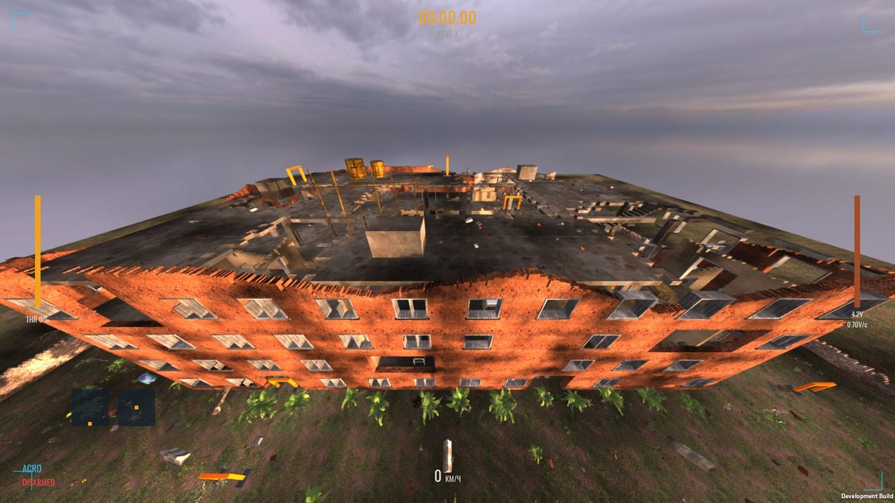
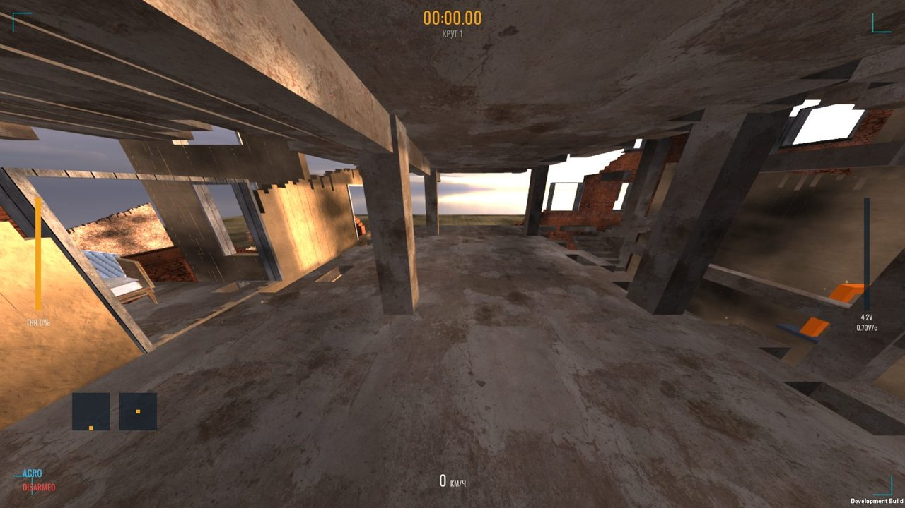
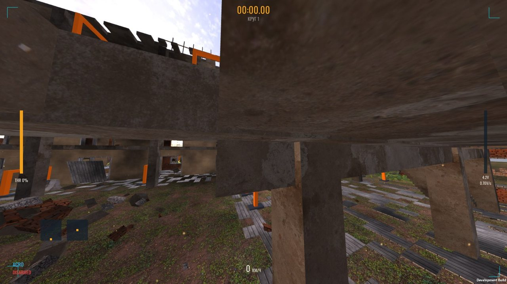
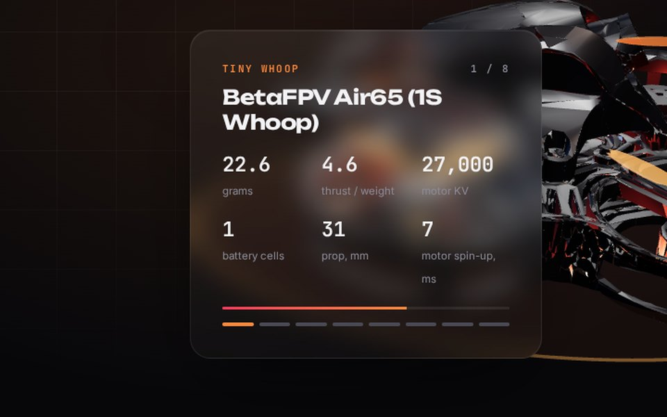
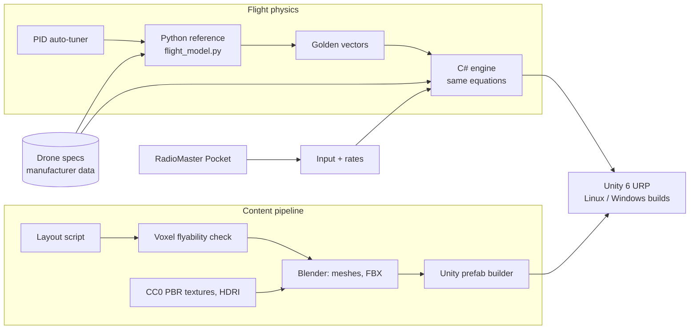

# FPV drone simulator

A physics-first FPV drone simulator for Linux and Windows, flown with a real RadioMaster Pocket radio. The goal is that each drone *feels* like its real counterpart: every model is built from manufacturer data, not tuned by eye.

> **This is a showcase repo.** The simulator is in active development (since September 2026) and its source is private for now. Here you'll find what it does, how it's built, and how it looks.

| | |
|---|---|
|  |  |
|  | |

## What makes it different

- **Own flight model.** Written first as a Python reference implementation, verified against golden test vectors, then ported to a C# engine inside Unity. The Python side runs without a GPU, so the physics can be checked anywhere, including in CI.
- **Data-driven drones.** Mass, motor KV, prop size, thrust, battery cell count, voltage sag, rotor inertia and motor spin-up time come from manufacturer specs.
- **PID auto-tuner.** Finds PID gains for each drone class against a target step response, instead of hand-tuning.
- **Effects that matter in real flying:** acro rates, battery voltage sag under load, vortex ring state.
- **Procedural maps.** A 4-storey abandoned building (48 × 28 m, atrium, stairwells, collapsed floors, 22 gates) is generated from a single layout file, so visuals, colliders and race gates never drift apart. A voxel flyability check proves every gate is reachable before the map is built.
- **Real hardware input.** RadioMaster Pocket over USB, with configurable rates and key bindings.

## Architecture

## Drones

8 drones, from a 22 g tiny whoop to a 1.1 kg 7" long-range build:

| Drone | Class | Mass, g | Motor KV | Prop, mm | Cells | Thrust/weight |
|---|---|---:|---:|---:|---:|---:|
| BetaFPV Air65 (1S Whoop) | whoop | 22.6 | 27,000 | 31 | 1S | 4.6 |
| BetaFPV Meteor75 Pro (1S analog) | whoop | 30.5 | 21,000 | 45 | 1S | 5.0 |
| HappyModel Mobula7 (1S 75mm whoop) | whoop | 24.0 | 20,000 | 40 | 1S | 4.0 |
| BetaFPV Pavo Pico (2S cinewhoop) | cinewhoop | 78.0 | 14,000 | 45 | 2S | 2.8 |
| HappyModel Crux35 (4S 3.5") | toothpick | 87.0 | 3,000 | 89 | 4S | 7.5 |
| 5" Racer 6S (2207 1950KV) | racer5 | 580.0 | 1,950 | 127 | 6S | 13.0 |
| 5" Freestyle 6S (2207 1800KV) | freestyle5 | 650.0 | 1,800 | 130 | 6S | 9.5 |
| 7" Long Range 6S (2807 1300KV) | longrange7 | 1100.0 | 1,300 | 178 | 6S | 5.0 |

## Stack

`Unity 6 (URP)` `C#` `Python` `Blender (bpy)` · Linux and Windows builds, CI on my own server

## Interactive demo

The rotating 3D drone models with live spec cards are on my portfolio site: **[pavlohavras73.github.io](https://pavlohavras73.github.io)** (slide 3).

---

Built by [Pavlo Havras](https://github.com/pavlohavras73).
